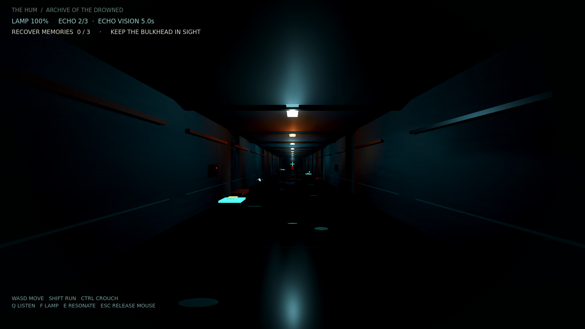

# THE HUM: Archive of the Drowned

A first-person 3D horror prototype built for **Godot 4.7.2**. Explore a submerged acoustic archive, recover three fragments visible only in a short-lived listening pulse, and escape before the Listener reaches the last place you called from.

## The mechanic: sound is a breadcrumb you choose to leave

Most horror games make noise a passive penalty. Here, **Q sends a deliberate echolocation pulse**: it exposes nearby memory fragments and the Listener for a few seconds, but also gives the creature your exact pulse origin as its next destination. You decide when information is worth the risk. The creature hunts the *last echo*, not your live position, so you can use a pulse to misdirect it, then move quietly while it investigates. The flashlight can force it to recoil if you keep the beam trained on it, but it burns through its finite cell and announces where you are. Three resonator plinths recharge both resources.

## Features in this prototype

- First-person mouse-look, walking, running, crouching, head-bob and subtle FOV shift.
- Original procedural 3D corridor architecture, wet reflective floor accents, service bays, conduits, warning details, fog, filmic tonemapping, emissive lamps and shadow-casting lights.
- A hand-assembled articulated creature with breathing, head-tilt, limb-swing and pulse-reveal animation.
- Echo rings, timed shard visibility, three collectible memory fragments, a locked exit, safe recharge plinths, flashlight battery, and caught/win states.
- All level geometry, materials, creature parts, lighting, HUD treatment and animations are created at runtime in GDScript. The ambient drone, echo call, and heartbeat are synthesized locally (`tools/generate_audio.py`); the included DejaVu Sans font is licensed under its bundled license. **No internet game assets or extra connectors are required.**

## Run it

1. Open `project.godot` in Godot 4.7.2 (or a compatible Godot 4 release) and run the main scene. The scene is `res://scenes/main.tscn`.
2. Click the game window if needed to capture the mouse. Press **Esc** to release it; click to recapture.

| Key | Action |
|---|---|
| WASD | Move |
| Shift | Run faster (slightly drains the lamp cell) |
| Ctrl | Crouch and move slowly |
| Q | Spend a charge to reveal nearby memories; the echo lures the Listener |
| F | Toggle the flashlight (finite battery; light can repel the creature) |
| E | Sync with a nearby resonator plinth |
| R | Restart after escape or capture |
| Esc | Release / recapture mouse |

**Objective:** Find the three memory fragments. They are hidden in the corridor until a pulse reveals them. The resonator plinths restore pulse charges and the lamp cell while you stand nearby. Reach the far bulkhead after collecting all three.

## Rebuild the audio

Run `python3 tools/generate_audio.py` from the project root. It regenerates the three small WAV files using only Python standard-library modules.

## Engine version

The project now targets **Godot 4.7.2**. The earlier Godot 3 version mismatch has been resolved; the project uses Godot 4 node classes, scene format, input, rendering, and UI APIs.

## Scope

This is a playable **vertical-slice prototype**, not a finished commercial production: its art is purpose-built procedural geometry rather than photogrammetry or licensed character scans. It favors atmosphere, readable silhouettes, interaction, and a complete short gameplay loop. No third-party visual assets are bundled.
